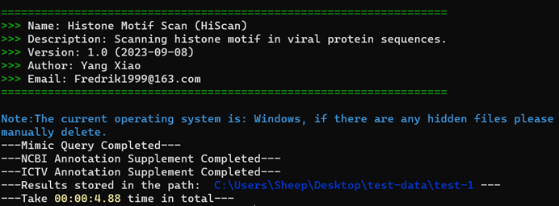
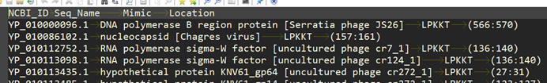

# Hiscan：Histone motif scanning
Histone Motif Scan (HiScan) is a Python3-based character interface program that can be used and deployed on multiple systems including Windows, Linux and MacOS. This software is mainly used to quickly identify the presence of histone mimicry (HM) motifs in viral protein sequences.
## 1. Download and install
Currently HiScan only supports local downloads, you can download and install it using the file `setup.py`.
You need to download the repository, and then run:
```
python setup.py install
hiscan -h
```
## 2. Getting help
You can use "-h" or "--help" to get the help document. The following is a brief introduction to the each parameter of HiScan:
Parameter | Description
--------- | ----------
-h,--help | Show the help message and exit.
-i | The file path of the viral protein sequence that needs for analysis in the file format "fasta". Supports input as a file or folder.
-mr | The raw result of the viral protein sequence query for HM motifs is derived from the "-m" parameter result without any additional annotation information. The file format is "txt", "csv" or "xlsx", and the default is "txt".
-nr | The result of viral protein sequence query of HM motifs, with NCBI species annotation information, derived from the "-na" parameter results, no host annotation information, file format is "txt", "csv" or "xlsx", default is "txt".
-m | HM motifs that need to be queried in viral protein sequences, file formats support "txt" and "xlsx".
-na | To supplement the query results of NCBI species annotation information, input the NCBI protein annotation file (" gpff "format) path, support the form of file or folder input.
-ia | The query results are supplemented with ICTV host annotation information, and the virus classification table path of ICTV is only supported in the form of a separate file, and this step must rely on the NCBI species annotation information, so it should be used after the "-na" parameter.
-mc | The type and number of HM motifs in the raw result file will be counted and their occurrence frequency will be calculated.
-ms | The amino acid preference will be calculated based on the HM motif input file and the result will be saved in matrix form, while the HM motif combination with the highest probability will be given.
-mp | Based on the HM motif input file, all possible HM motif combinations will be calculated and their probabilities will be calculated simultaneously, and the number of motifs is recommended to be no more than 15.
-cc | Based on the raw file results, the number and frequency of the HM motifs included in each grade under the different classification criteria will be calculated. By default, "family" is used for statistics.
-hc | Based on the raw file results, the number and frequency of the occurrence of different host sources of the simulation motif will be calculated.
-ct | Specify the classification level of the '-cc' parameter, which can be selected from 'Realm', 'Kingdom', 'Phylum', 'Class', 'Order', 'Family'.
-o | The result file path.
-on | Specify the name of the output file, default is "Result".
-ot | Specify the format of the output file, support "txt", "csv" and "xlsx" three formats of output, the default is "txt", recommended to use "xlsx" table format.
## 3. Example of usage
### 3.1 Raw material preparation
You will need to prepare a viral protein sequence file (required), a HM motif file (required), and protein annotation files (optional), in which the HM motif file content format should be as follows:
>[!NOTE]
>You can download viral protein and its annotation information file from the NCBI database (https://ftp.ncbi.nlm.nih.gov/refseq/release/viral/). The host annotation file is from the official website of ICTV (https://ictv.global/vmr), and HM motifs are from literature review. The following is an example of Windows platform operation.

#### (1) No motif annotation information
Just the simple HM motif name without any additional information, note that the motif name should only be in the first column.
Col-A | Col-B
------|------
LPKKT |
RGKQG |
GGKAR |
RAKAK |
... | 

#### (2) Motif with annotation information
The format of the motif file with annotated information should be as follows, where the first column is the motif name, the second column is the subunit type of the histone, and the third column is the modification type of the motif. If the subunit type and modification type of some HM motifs are not clear, please replace them with the value "None" or a value. The rest of the annotation information is not currently supported.
Col-A | Col-B | Col-C
-----|------|-----
LPKKT | H2A | Methylation
RGKQG | H2A | Acetylation
GGKAR | H2A | Acetylation
KKTES | H2A | Phosphorylation
PAKSA | H2B | Methylation
... | ... | ...

### 3.2 Obtaining raw result
#### Case 1: NCBI and ICTV annotation files are complete
You can refer to the following code, you need to input the viral protein sequence, HM motif file, NCBI and ICTV annotation file:
```
hiscan -i your/viral_protein_file_path/ -m your/motif_path/ -na your/NCBI_annotation_path/ -ia your/ICTV_annotation_path -o your/result_path -ot result_format
```
The output information is as follows:



And your results should look like this：
NCBI_ID|Seq_Name|Mimic|Location|Histone_Subunit|Modification|Realm|Kingdom|Phylum|Class|Order|Family|Species|Host_Source
--- | --- | --- | --- | --- | --- | --- | --- | --- | --- | --- | --- | --- | ---
YP_009175074.1|polyprotein [Bean rugose mosaic virus]|LPKKT|(1179:1183)|H2A|Methylation|Riboviria|Orthornavirae|Pisuviricota|Pisoniviricetes|Picornavirales|Secoviridae|Bean rugose mosaic virus|plants
YP_009272812.1|polyprotein [Washington bat picornavirus]|LPKKT|(969:973)|H2A|Methylation|Riboviria|Orthornavirae|Pisuviricota|Pisoniviricetes|Picornavirales|Picornaviridae|Washington bat picornavirus|None
YP_009333551.1|hypothetical protein 1 [Beihai picorna-like virus 85]|LPKKT|(438:442)|H2A|Methylation|Riboviria|None|None|None|None|None|Beihai picorna-like virus 85|None
... | ... | ... | ... | ... | ... | ... | ... | ... | ... | ... | ... | ... | ...

#### Case 2: There is no annotation information
There is no annotation information, and even the HM motif file has no additional information, at which point only the virus protein sequence file and the HM motif file need to be passed in:
```
hiscan -i your/viral_protein_file_path/ -m your/motif_path/ -o your/result_path
```
Your results should look like the following:



#### Case 3: Supplement annotation information to raw result
If the result file of case 2 is generated, the NCBI or ICTV annotation file or the self-written annotation file (in accordance with the gpff format of NCBI) is available, then the result file of case 2 can be followed for analysis.
The annotation information that complements NCBI is taken as an example below:
```
hiscan -mr your/raw_result_path/ -na your/NCBI_annotation_file -o your/result_path
```
### 3.3 Analysis of motif residue skewness
If you want to calculate the skewness of the HM motifs, you just need to input the HM motif file, you can refer to the following code:
```
hiscan -i your/motif_path/ -ms -o your/result_path
```
And your result should look like the following:
Col_0 | Col_1 | Col_2 | Col_3 | Col_4
--- | --- | --- | --- | ---
('R', 0.15094)|('G', 0.15094)|('K', 0.75472)|('Q', 0.09434)|('G', 0.13208)
('G', 0.13208)|('G', 0.15094)|('K', 0.75472)|('A', 0.13208)|('R', 0.03774)
('R', 0.15094)|('A', 0.16981)|('K', 0.75472)|('A', 0.13208)|('K', 0.09434)
('K', 0.11321)|('A', 0.16981)|('K', 0.75472)|('T', 0.09434)|('R', 0.03774)
... | ... | ... | ... | ...

### 3.4 Predicting HM motifs
If you want to predict possible HM motifs, you need to input a file of HM motifs as a background, and HiScan will calculate all possible combinations of HM motifs and sort them by probability.
```
hiscan -i your/motif_path/ -mp -o your/result_path
```
And your results should look like this：
Mimic | Probabiliry
--- | ---
AGKVT | 0.0020117850867
AGKVL | 0.0020117850867
VAKVT | 0.0013411900578
... | ...

### 3.5 Other Analyses
If you want to perform some additional analysis on the raw result, such as host origin statistics, motif statistics, and so on, you can refer to the following code:
```
hiscan -i your/raw_result_path/ -mc -o your/result_path
```
And your results should look like this：
Mimic|Count|Frequency
--- | --- | ---
ARKSA|584|0.09211
ATKAA|467|0.07366
ARKST|300|0.04732
SGRGK|281|0.04432
GTKAV|270|0.04259
VYKVL|224|0.03533
... | ... | ...
